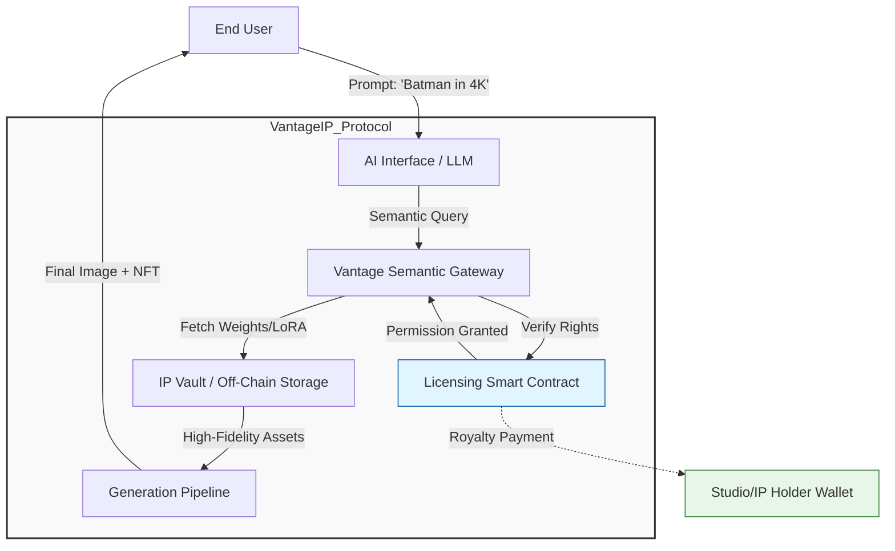
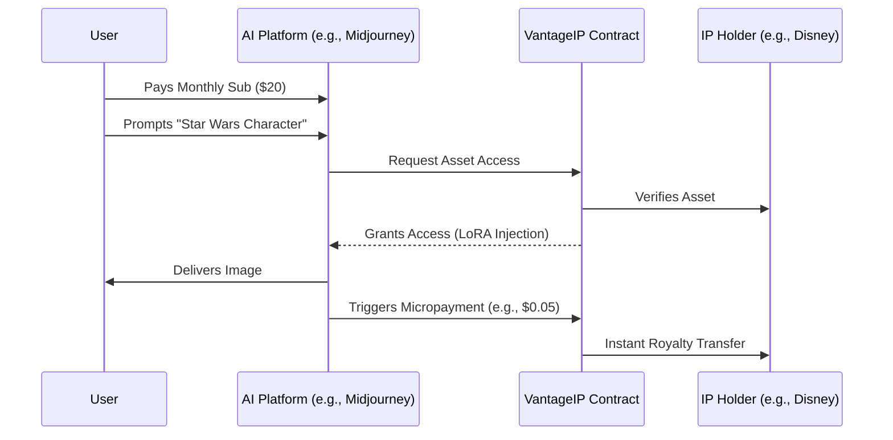

# VantageIP: The Decentralized Licensing Layer for Generative AI

**Version:** 1.0
**Date:** November 2025

---

## Table of Contents

1. [Abstract](#1-abstract)
2. [Introduction & Market Context](#2-introduction--market-context)
   - [The Copyright Deadlock](#21-the-copyright-deadlock)
   - [The Quality Gap](#22-the-quality-gap)
3. [The Solution: VantageIP](#3-the-solution-vantageip)
   - [From Permissions to Remuneration](#31-from-permissions-to-remuneration)
   - [License-as-a-Service (LaaS)](#32-license-as-a-service-laas)
4. [Technical Architecture](#4-technical-architecture)
   - [The IP Vault (Hybrid Storage)](#41-the-ip-vault-hybrid-storage)
   - [The Vantage Semantic Gateway](#42-the-vantage-semantic-gateway)
   - [Smart Contract Logic](#43-smart-contract-logic)
   - [System Diagram](#44-system-diagram)
5. [Proof of Generation (PoG)](#5-proof-of-generation-pog)
6. [Tokenomics & Economic Model](#6-tokenomics--economic-model)
   - [Royalty Distribution Flow](#61-royalty-distribution-flow)
   - [Stakeholder Incentives](#62-stakeholder-incentives)
7. [Use Case Scenarios](#7-use-case-scenarios)
8. [Conclusion](#8-conclusion)

---

## 1. Abstract

The current landscape of Generative AI is fractured by a "Copyright Deadlock." AI models face legal scrutiny for unauthorized training on intellectual property (IP), while users encounter restrictive "content blocks" and "guardrails" when attempting to engage with popular culture characters and assets.

**VantageIP** introduces a decentralized infrastructure that connects IP Holders (e.g., Major Studios, Publishers) directly to AI Service Providers (e.g., LLMs, Image Generators). By utilizing blockchain-based smart contracts and secure API gateways, VantageIP allows for the legal, real-time streaming of high-resolution source material into AI generation pipelines. This system transforms IP piracy into a monetized ecosystem, ensuring creators are compensated, AI models are legally compliant, and users receive high-quality, officially sanctioned outputs.

---

## 2. Introduction & Market Context

### 2.1 The Copyright Deadlock

The rise of Generative AI has created a legal and ethical minefield. AI labs are currently facing class-action lawsuits for scraping copyrighted data to train their models in a "Black Box" environment. To mitigate liability, providers have hard-coded crude filters into their models. When a user prompts for specific IP (e.g., "Batman in a Robin suit"), the model often refuses the request. This results in a degraded user experience and a stifling of creativity.

### 2.2 The Quality Gap

Even when generation is allowed, current AI models suffer from "Quality Hallucinations." Because models are often trained on low-resolution images scraped from the web (compressed JPEGs, fan art), they lack the fidelity of the source material.

- **Current State:** Models guess what a character looks like based on public internet noise.
- **Result:** Inaccurate costumes, distorted logos, and uncanny valley likenesses.

### 2.3 The Revenue Vacuum

Studios and IP holders are witnessing the Napster-ization of their assets. Their IP is being diluted and used without compensation. VantageIP posits that the solution is not to sue the technology out of existence, but to build the "Spotify" of Generative AI—a streaming layer for IP rights.

---

## 3. The Solution: VantageIP

VantageIP proposes a **"License-as-a-Service" (LaaS)** protocol. It acts as an immutable bridge where Studios deposit "Digital Masters" of their assets, and AI models connect to these assets via API keys linked to smart contracts.

### 3.1 From Permissions to Remuneration

We are moving the industry from a "Permissions-Based" blocking system (DMCA takedowns) to a "Remuneration-Based" enabling system.

1.  **The Studio** uploads reference weights (LoRAs) or high-res assets.
2.  **The AI Model** detects a request for that asset.
3.  **The Protocol** validates the license and injects the asset.
4.  **The Payment** is streamed instantly via blockchain.

---

## 4. Technical Architecture

VantageIP utilizes a hybrid architecture to solve the scalability issues of blockchain while maintaining the trustlessness of a decentralized ledger.

### 4.1 The IP Vault (Hybrid Storage)

Storing 8K video files or 3D meshes on-chain is cost-prohibitive.

- **Off-Chain Storage:** Studios host "Digital Masters" (high-res posters, frame-by-frame movie data, 3D assets, standardized LoRA weights) in secure, private servers or decentralized storage solutions (IPFS/Arweave/Filecoin) with encrypted access control.
- **On-Chain Registry:** The blockchain stores a hashed "fingerprint" (SHA-256) of these assets alongside the licensing terms (price per generation, allowable contexts). This creates a "Digital Twin" on the ledger.

### 4.2 The Vantage Semantic Gateway

This is the core middleware. When a user interacts with an AI client (e.g., via Discord or Web UI):

1.  **Prompt Analysis:** NLP parsers identify entities (e.g., "Sonic", "Ferrari").
2.  **Handshake:** The gateway queries the Vantage Smart Contracts to check for active licensing agreements between the AI Provider and the IP Holder.
3.  **Asset Injection:** Upon verification, the Gateway retrieves specific "LoRA" (Low-Rank Adaptation) weights or reference images from the IP Vault.
4.  **Generation:** The AI generates the image using these official sources, ensuring 100% canon accuracy.

### 4.3 Smart Contract Logic

Contracts manage the "Stream of Rights."

- `Function checkLicense(assetID, providerID)`: Returns boolean permission.
- `Function triggerRoyalty(assetID, usageCount)`: Executes micropayment.

### 4.4 System Diagram

---

## 5. Proof of Generation (PoG)

To solve the issue of provenance and user rights, VantageIP introduces **Proof of Generation**.

When the final image is delivered to the user, the system mints a lightweight usage token (NFT) or cryptographic signature associated with that specific generation.

- **Metadata:** Includes the Hash of the generated image, the Hash of the Source IP used, and the Timestamp.
- **Rights Management:** This token grants the user the right to display the image on social media legally. It serves as a digital receipt proving that the subscription fee covered the licensing cost.
- **Verification:** Social platforms (X, Instagram) can query the Vantage API to verify the "Official Fan Creation" badge on the content.

---

## 6. Tokenomics & Economic Model

The system replaces the "Lawsuit Model" with a "Streaming Royalty Model."

### 6.1 Royalty Distribution Flow

### 6.2 Stakeholder Incentives

| Stakeholder      | Incentive         | Benefit                                                                           |
| :--------------- | :---------------- | :-------------------------------------------------------------------------------- |
| **AI Companies** | B2B Licensing Fee | Legalizes datasets; protects from litigation; access to high-res training data.   |
| **IP Holders**   | Per-Gen Royalty   | New revenue stream; protection of brand integrity; analytics on IP usage trends.  |
| **End Users**    | Seamless UX       | No "content blocks"; higher fidelity outputs (4K/8K); legal ownership of fan art. |

---

## 7. Use Case Scenarios

### Scenario A: The Cross-Over Event

- **Current State:** User asks ChatGPT for "Sonic the Hedgehog driving a Ferrari." The model blocks it due to trademark collision or generates a generic red car and a distorted blue hedgehog.
- **VantageIP State:** The AI checks the protocol. SEGA and Ferrari have active API contracts in the Vantage Registry. The prompt is allowed. The system pulls the official Sonic 3D model weights and a Ferrari CAD-based render.
  - **Result:** A stunning, brand-accurate image.
  - **Financial:** A fraction of the user's subscription is split between the AI Provider, SEGA, and Ferrari.

### Scenario B: Ethical Model Training

- **Current State:** An image model scrapes the web for images of a new movie, resulting in low-quality, distorted outputs that spoil the movie or look terrible.
- **VantageIP State:** The Studio uploads the movie’s press kit, raw frames, and concept art to the Protocol's Vault _before_ the movie release. The AI model legally trains a "sub-model" on this high-quality data.
  - **Result:** On release day, users can generate officially styled fan art immediately using the specific "Movie Mode."

---

## 8. Conclusion

The transition of intellectual property into the public domain via piracy or unauthorized AI scraping is inevitable if the status quo remains. VantageIP does not fight this tide; it creates a canal to guide it.

By standardizing the API connection between Studios and AI models, VantageIP ensures that:

1.  **Studios** are paid.
2.  **AI Models** improve in quality and legality.
3.  **Users** are empowered to create with the full breadth of human culture at their fingertips.

**VantageIP is the inevitable infrastructure of the generative internet.**
